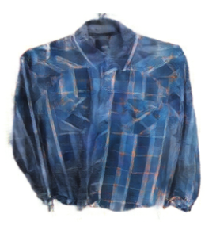
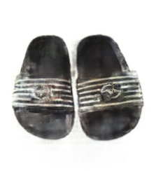
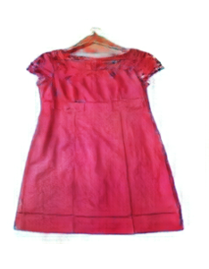

# COMP4471-Random-Clothes-Generation

PyTorch reimplementation of [Pix2Pix](https://arxiv.org/abs/1611.07004) and apply for random clothes generation based on edge information

## Dataset

Dataset available: https://www.kaggle.com/datasets/agrigorev/clothing-dataset-full <br>
Or other images containing clothes only

## Installation

Python Version: 3.10.9 <br><br>
Make sure conda is installed

```
1. conda install pytorch==1.13.0 torchvision==0.14.0 pytorch-cuda=11.7 -c pytorch -c nvidia
2. pip install -r requirements.txt
```

## Getting started

```
1. Install images from https://www.kaggle.com/datasets/agrigorev/clothing-dataset-full
2. Put images under datasets/images directory
3. Run main.ipynb
```

## Training

Hyperparameters can be tuned in `model/pix2pix/config.py`

## Results

- Search `datasets/evaluation` directory to see the generated results for each 5 epochs of training
- Run `tensorboard --logdir=tensorboard` to see the history

### Some Generated Results:

<table>
    <tr>
        <td>  </td>
        <td>  </td>
        <td>  </td>
    </tr>
</table>
